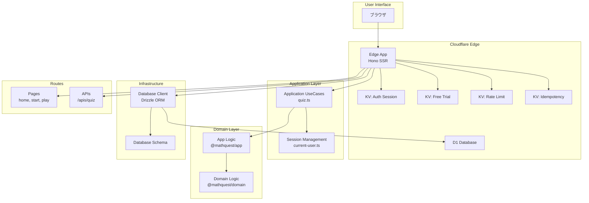
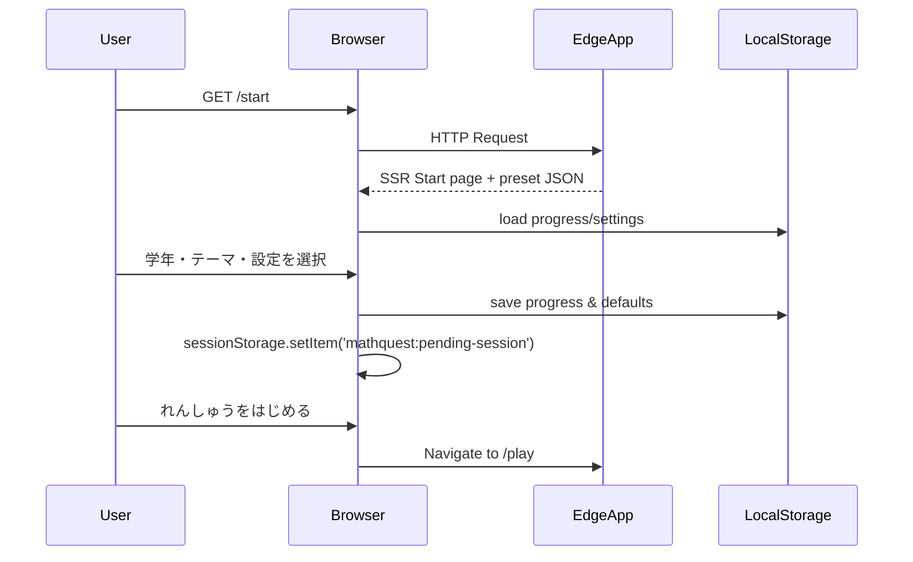
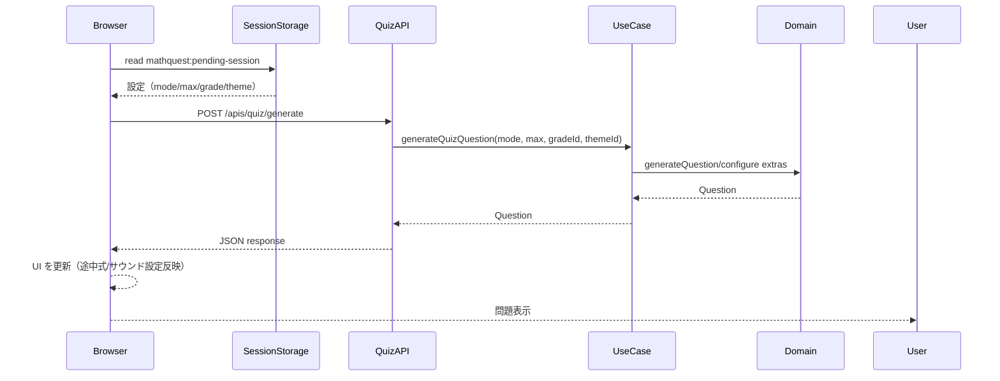
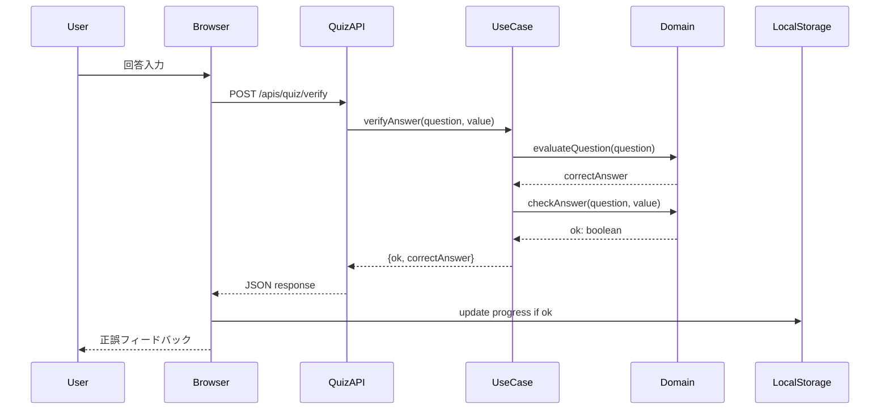

# AGENTS.md

## 概要

MathQuestは小学生向けの算数学習プラットフォームで、Cloudflare Workers上で動作するHonoベースのSSRアプリケーションです。monorepoアーキテクチャを採用し、Edge Runtime、API/フロントエンドパッケージ、Terraform管理のインフラストラクチャを一つのリポジトリで管理しています。

## 現在の主要機能

- **スタート画面（`/start`）**
  - 学年（小1〜小6）、計算種類（たし算・ひき算・かけ算・四則演算）、テーマプリセット（例: 「たし算 20 まで」「ひき算 50 まで」）を選択。
  - 効果音・途中式表示のトグル、問題数（本番: 10/20/30、開発モード: 1 問のデバッグオプション）を切り替え。
  - `mathquest:progress:v1`（解答数/正解数/最後の学年）、`mathquest:sound-enabled`、`mathquest:show-working`、`mathquest:question-count-default` に設定を保存。
  - 選択内容は `mathquest:pending-session` として `sessionStorage` に退避し、プレイ画面へシームレスに引き継ぎ。
- **プレイ画面（`/play`）**
  - 3 秒カウントダウン後に問題を表示。テンキー UI、ストリーク表示、途中式のトグル、サウンド再生を実装。
  - `/apis/quiz/generate` で新しい問題を取得し、`/apis/quiz/verify` で採点。正解時は進捗をローカルストレージへ反映。
  - ラウンド完了時は結果カードで正答数・経過時間を提示し、スタート画面への導線を表示。
- **ユースケース / API**
  - `generateQuizQuestion` は学年・テーマに応じて `generateGradeOneQuestion` や複数項目の加減算ロジックを選択。
  - `verifyAnswer` はクライアントから渡された途中式 (`extras`) を含む問題を評価し、正解値と正誤を返却。
- **共有ロジック**
  - `@mathquest/domain` が全ての問題生成・採点ロジックを提供。学年別テーマや複数ステップ計算を純関数として実装。
  - `@mathquest/app` が出題回数や正解数のカウントを担当し、UI から副作用を切り離してテストしやすい構造にしている。

## システムアーキテクチャ

### 全体構成図



### モジュール依存関係

```mermaid
graph LR
    subgraph "Apps"
        Edge[@mathquest/edge]
        API[@mathquest/api]
        Web[@mathquest/web]
    end

    subgraph "Packages"
        Domain[@mathquest/domain]
        App[@mathquest/app]
    end

    Edge --> App
    Edge --> Domain
    API --> App
    API --> Domain
    App --> Domain
```

## プロジェクト構成

### ディレクトリ構造

```text
mathquest/
├── apps/                    # アプリケーション群
│   ├── edge/               # Cloudflare Workers エッジアプリ（メイン）
│   │   ├── src/
│   │   │   ├── application/        # アプリケーション層
│   │   │   │   ├── usecases/      # ユースケース（quiz.ts）
│   │   │   │   └── session/       # セッション管理
│   │   │   ├── infrastructure/    # インフラ層
│   │   │   │   └── database/      # DB クライアント & スキーマ
│   │   │   ├── routes/            # ルーティング
│   │   │   │   ├── pages/         # SSR ページ（home, start, play）
│   │   │   │   └── apis/          # BFF API（/apis/quiz）
│   │   │   ├── views/             # ビュー層
│   │   │   │   └── layouts/       # レイアウトコンポーネント
│   │   │   ├── middlewares/       # ミドルウェア（i18n等）
│   │   │   ├── env.ts             # 環境変数型定義
│   │   │   └── index.tsx          # エントリーポイント
│   │   └── wrangler.toml          # Cloudflare Workers設定
│   ├── api/                # Node.js API サーバー（開発用）
│   └── web/                # Hono Webサーバー（開発用）
├── packages/                # 共有パッケージ
│   ├── domain/             # ドメインロジック
│   │   └── src/
│   │       └── index.ts    # 問題生成、計算ロジック
│   └── app/                # アプリケーションロジック
│       └── src/
│           └── index.ts    # クイズ管理、回答チェック
├── infra/                  # インフラ構成
│   ├── terraform/          # Terraform設定
│   └── migrations/         # D1 データベースマイグレーション
└── docs/                   # ドキュメント
```

### ワークスペース構成

pnpm workspacesによるmonorepo構成：

- **apps/**: 実行可能なアプリケーション

  - `@mathquest/edge`: Cloudflare Workers上のメインアプリ（SSR + BFF API）
  - `@mathquest/api`: Node.js開発用APIサーバー
  - `@mathquest/web`: Hono開発用Webサーバー

- **packages/**: 共有ライブラリ
  - `@mathquest/domain`: ドメインロジック（問題生成、計算ルール）
  - `@mathquest/app`: アプリケーションロジック（クイズ管理、回答検証）

## 主要機能モジュール

### 1. ドメイン層（@mathquest/domain）

**責務**: 算数問題の生成と計算ロジック

**主要な型・関数**:

- `Mode`: 問題モード (`'add' | 'sub' | 'mul' | 'mix'`)
- `QuizConfig`: クイズ設定（モード、最大値）
- `Question`: 問題データ構造（a, b, op, extras, answer）
- `ExtraStep`: 途中式ステップ（op: '+' | '-', value: number）

**主要関数**:

- `generateQuestion(config)`: 基本問題生成
- `generateGradeOneQuestion(max)`: 1年生向け問題生成
- `evaluateQuestion(question)`: 問題の答えを計算
- `formatQuestion(question)`: 問題を文字列化
- `checkAnswer(question, input)`: 回答の正誤判定
- `pickOp(mode)`: モードから演算子を選択

**ファイル**: `packages/domain/src/index.ts:1-223`

### 2. アプリケーション層（@mathquest/app）

**責務**: クイズセッションの管理と状態管理

**主要な型・関数**:

- `Quiz`: クイズセッション状態（config, index, correct）
- `StartQuizInput`: クイズ開始時の入力

**主要関数**:

- `createQuiz(input)`: 新規クイズセッション作成
- `nextQuestion(quiz)`: 次の問題を生成
- `checkAnswer(quiz, question, value)`: 回答チェック & 状態更新

**ファイル**: `packages/app/src/index.ts:1-32`

### 3. エッジアプリケーション（@mathquest/edge）

#### 3.1 エントリーポイント（`src/index.tsx`）

**責務**: Honoアプリケーションの初期化とルーティング

**主要設定**:

- ミドルウェア: logger, secureHeaders, prettyJSON, i18n
- SSR レンダラー: jsxRenderer + Document layout

**ルート構成**:

- **Pages**:

  - `/`: ホーム（Home）
  - `/start`: 設定ウィザード（Start）
  - `/play`: 練習セッション（Play）

- **Auth**:

  - `/auth/guest-login`: ゲストログイン
  - `/auth/logout`: ログアウト
  - `/auth/signin`: サインインページ（ダミー）

- **API**:
  - `/apis/quiz`: クイズ関連API

**ファイル**: `apps/edge/src/index.tsx:1-104`

#### 3.2 アプリケーションユースケース（`src/application/usecases/quiz.ts`）

**責務**: 問題生成と回答検証のビジネスロジック

**主要関数**:

- `generateQuizQuestion(input)`: 学年・モード・最大値に応じた問題生成

  - `gradeId`に応じて異なる問題パターン生成
    - `'grade-1'`: 1年生向け
    - `'practice-add-three'`: 3項加算
    - `'practice-add-four'`: 4項加算
    - `'practice-add-mixed-digits'`: 1桁+2桁
    - `'practice-sub-double-digit'`: 2桁減算
    - `'practice-mix-three'`: 3項加減混合
    - `'practice-mix-four'`: 4項加減混合

- `verifyAnswer(input)`: 回答の正誤検証

**補助関数**:

- `clauseAddQuestion(values, op)`: 連続加算問題生成
- `generateAdditionMulti(terms, max)`: 多項加算生成
- `generateOneDigitPlusTwoDigit()`: 1桁+2桁問題生成
- `generateDoubleDigitSubtraction()`: 2桁減算生成
- `generateAddSubMix(terms, max)`: 加減混合問題生成

**ファイル**: `apps/edge/src/application/usecases/quiz.ts:1-152`

#### 3.3 セッション管理（`src/application/session/current-user.ts`）

**責務**: ユーザー認証・セッション管理

**ファイル**: `apps/edge/src/application/session/current-user.ts`

#### 3.4 インフラストラクチャ層（`src/infrastructure/database/`）

**責務**: データベースアクセスとスキーマ定義

**主要ファイル**:

- `client.ts`: Drizzle ORMクライアント
- `schema.ts`: D1データベーススキーマ定義

#### 3.5 ルート定義

**Pages**（`src/routes/pages/`）:

- `home.tsx`: ホームページSSR
- `start.tsx`: 設定ウィザードSSR
- `start.client.ts`: 設定ウィザードクライアントロジック（~20KB）
- `play.tsx`: 練習セッションSSR
- `play.client.ts`: 練習セッションクライアントロジック（~39KB）
- `grade-presets.ts`: 学年別プリセット定義

**APIs**（`src/routes/apis/`）:

- `quiz.ts`: クイズAPI（問題生成、回答検証）

#### 3.6 ミドルウェア（`src/middlewares/`）

- `i18n.ts`: 国際化ミドルウェア（言語設定）

#### 3.7 環境設定（`src/env.ts`）

**Cloudflare Bindings**:

- `KV_FREE_TRIAL`: 無料トライアル管理
- `KV_AUTH_SESSION`: 認証セッション
- `KV_RATE_LIMIT`: レート制限
- `KV_IDEMPOTENCY`: 冪等性保証
- `DB`: D1データベース
- `DEFAULT_LANG`: デフォルト言語（'ja'）
- `USE_MOCK_USER`: モックユーザー設定（開発用）

**ファイル**: `apps/edge/src/env.ts:1-12`

### 4. インフラストラクチャ

**構成**:

- `infra/terraform/`: Cloudflare Workers、KV、D1の設定
- `infra/migrations/`: D1データベースマイグレーションSQL

## 技術スタック

### ランタイム・フレームワーク

- **Cloudflare Workers**: エッジコンピューティングプラットフォーム
- **Hono**: 軽量Webフレームワーク（SSR対応）
- **Node.js 22**: 開発用サーバー
- **TypeScript 5.5**: 型安全な開発

### データストア

- **Cloudflare KV**: キー・バリューストア（セッション、キャッシュ）
- **Cloudflare D1**: SQLite互換データベース
- **Drizzle ORM**: TypeScript ORMライブラリ

### 開発ツール

- **pnpm 10**: パッケージマネージャー
- **mise**: ツールバージョン管理
- **just**: タスクランナー
- **pre-commit**: Git フック管理
- **Wrangler**: Cloudflare Workers CLI

### テスト

- **Vitest**: テストフレームワーク

## ビルド・デプロイフロー

### ビルド順序

```bash
pnpm build
```

1. `@mathquest/domain` のビルド（ドメインロジック）
2. `@mathquest/app` のビルド（アプリケーションロジック）
3. `@mathquest/api` のビルド
4. `@mathquest/web` のビルド

※ `@mathquest/edge`はWranglerが直接TypeScriptをバンドル

### 開発サーバー

```bash
# Edgeアプリ（推奨）
pnpm dev:edge

# APIサーバー
pnpm dev:api

# Webサーバー
pnpm dev:web
```

### デプロイ

```bash
cd apps/edge
pnpm deploy
```

## データフロー

### スタート設定フロー



### 問題生成フロー



### 回答検証フロー



## セキュリティ

- **Secure Headers**: Honoミドルウェアによる自動設定
- **Rate Limiting**: KV_RATE_LIMITによる制限
- **Idempotency**: KV_IDEMPOTENCYによる重複リクエスト防止
- **Session Management**: KV_AUTH_SESSIONによる認証管理

## パフォーマンス最適化

- **エッジコンピューティング**: Cloudflare Workersによる低レイテンシ
- **KVキャッシング**: セッションデータの高速アクセス
- **クライアントサイドロジック**: play.client.ts（39KB）、start.client.ts（20KB）で即応性確保
- **SSR**: 初回レンダリングの高速化

## 国際化（i18n）

- デフォルト言語: 日本語（`ja`）
- ミドルウェア: `apps/edge/src/middlewares/i18n.ts`
- 環境変数: `DEFAULT_LANG` in `wrangler.toml:32`

## テスト

- ユニットテスト: `apps/edge/src/application/usecases/__tests__/quiz.test.ts`
- テストフレームワーク: Vitest

## 今後の拡張ポイント

1. **ユーザー認証**: 現在はゲストログインのみ。本格的な認証機能追加可能
2. **学習履歴**: D1データベースを活用した学習データ永続化
3. **AIチューター**: 問題の難易度調整や個別最適化
4. **マルチプレイ**: リアルタイム対戦機能
5. **学年別コンテンツ拡充**: 2年生以上の単元追加

## 参考リンク

- [README.md](README.md): プロジェクトセットアップ
- [CLAUDE.md](CLAUDE.md): Claude Code向けプロジェクト規約
- [docs/AI_RULES.ja.md](docs/AI_RULES.ja.md): 詳細なコーディング規約
- [Hono Documentation](https://hono.dev/)
- [Cloudflare Workers Documentation](https://developers.cloudflare.com/workers/)
- [Drizzle ORM Documentation](https://orm.drizzle.team/)
