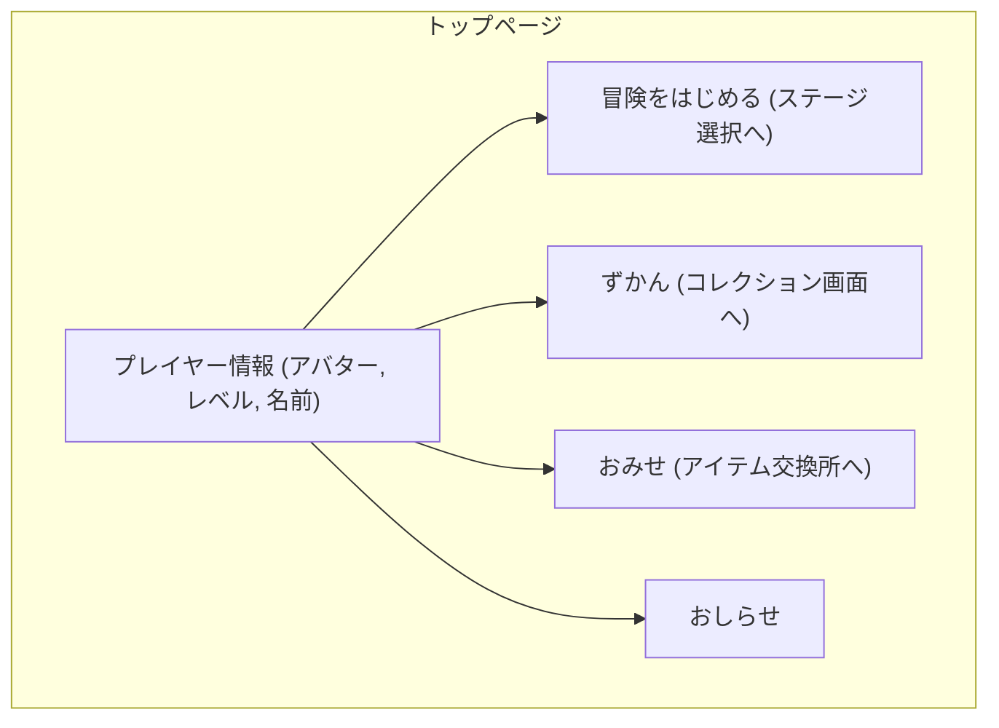
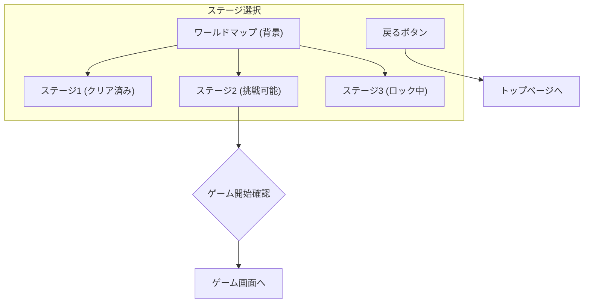
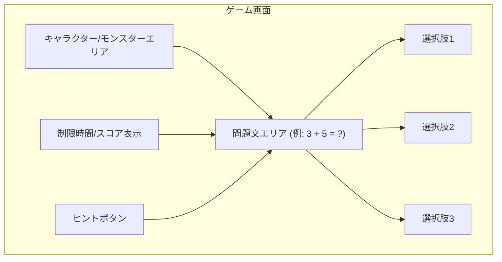
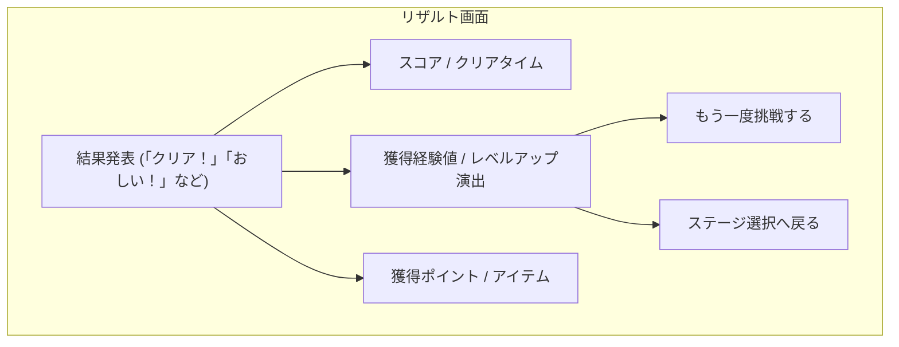
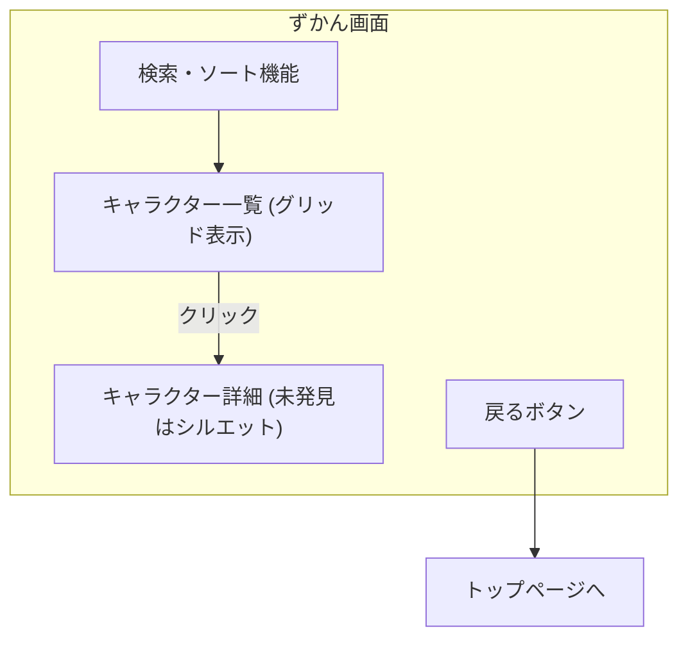

# mathquest: ワイヤーフレーム

以下に、mathquestの主要画面のワイヤーフレームを示します。これはUIの骨格であり、実際のデザインでは、より豊かな色彩、イラスト、アニメーションが加わります。

## 1. トップページ（ホーム画面）

ユーザーがログイン後に最初に訪れる画面です。ここから各コンテンツへ移動します。

| 要素               | 説明                                                                                 |
| :----------------- | :----------------------------------------------------------------------------------- |
| **プレイヤー情報** | プレイヤーのアバター、現在のレベル、名前を表示します。自分の成長が一目でわかります。 |
| **冒険をはじめる** | ゲームのメインであるステージ選択画面へ遷移します。                                   |
| **ずかん**         | これまでに出会ったモンスターやキャラクターの一覧を見ることができます。               |
| **おみせ**         | ゲーム内で集めたポイントを使って、アバターの衣装やアイテムを購入できます。           |
| **おしらせ**       | 運営からの新しいイベントやアップデート情報などを表示します。                         |

## 2. ステージ選択画面

冒険の舞台となるワールドマップです。クリアしたステージや、次に挑戦するステージが視覚的に表示されます。

| 要素                 | 説明                                                                                         |
| :------------------- | :------------------------------------------------------------------------------------------- |
| **ワールドマップ**   | 複数のステージが配置されたマップ。森、火山、海など、テーマごとに分かれています。             |
| **ステージアイコン** | 各ステージを表すアイコン。クリア状況によって見た目が変わります（例：クリア済みは旗が立つ）。 |
| **ゲーム開始確認**   | ステージをタップすると、挑戦する問題のレベルや内容が表示され、最終確認を促します。           |

## 3. ゲーム画面

実際に算数の問題を解く画面です。集中力を妨げないよう、シンプルで分かりやすいレイアウトを心がけます。

| 要素                   | 説明                                                                                                         |
| :--------------------- | :----------------------------------------------------------------------------------------------------------- |
| **問題文エリア**       | 計算式や文章問題が表示されます。イラストや図を交えて、視覚的に分かりやすくします。                           |
| **キャラクターエリア** | 問題を出すモンスターや、応援してくれるキャラクターが表示されます。正解・不正解によってアニメーションします。 |
| **選択肢**             | 答えの候補が3〜4つ表示されます。タップで回答します。                                                         |
| **制限時間/スコア**    | プレイヤーの集中力を高めるための要素。ステージによっては表示されない場合もあります。                         |
| **ヒントボタン**       | どうしても分からない時にヒントをもらえる機能。ヒントを見るとスコアが少し下がるなどのペナルティも検討します。 |

## 4. リザルト画面

ゲーム終了後に表示される結果画面です。達成感と次の挑戦への意欲を促します。

| 要素               | 説明                                                                                                   |
| :----------------- | :----------------------------------------------------------------------------------------------------- |
| **結果発表**       | 正解率やスコアに応じたメッセージとイラストで、プレイヤーの頑張りを称えます。                           |
| **スコア・経験値** | 今回のプレイで得られた結果を具体的に数値で示します。レベルアップ演出は特に派手にし、達成感を高めます。 |
| **獲得アイテム**   | 新しいキャラクターやアイテムを獲得した場合、ここで発表されます。                                       |
| **次のアクション** | 「もう一度挑戦する」か「ステージ選択に戻る」かを選び、スムーズに次の行動に移れるようにします。         |

## 5. ずかん画面

コレクション要素として、ゲーム内で出会ったキャラクターを確認できる画面です。

| 要素                 | 説明                                                                                 |
| :------------------- | :----------------------------------------------------------------------------------- |
| **キャラクター一覧** | これまでに出会ったモンスターやキャラクターがサムネイルで一覧表示されます。           |
| **キャラクター詳細** | 一覧からキャラクターを選択すると、大きなイラストと解説（豆知識など）が表示されます。 |
| **検索・ソート**     | 学年別、種類別などでキャラクターを並べ替えたり、検索したりできます。                 |

これらのワイヤーフレームを基に、より詳細な画面設計とビジュアルデザインを進めていきます。
