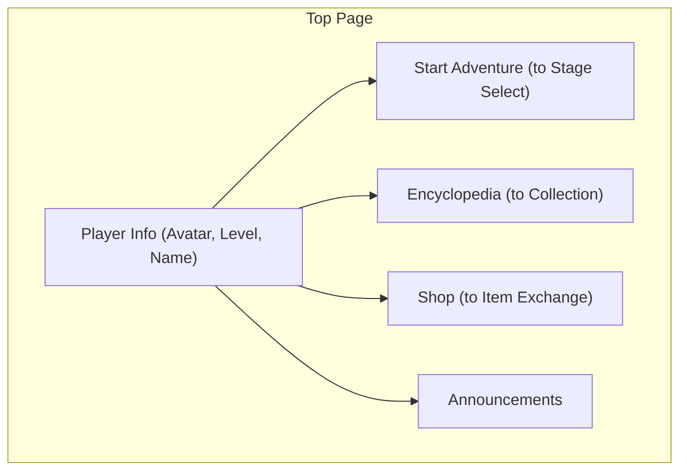
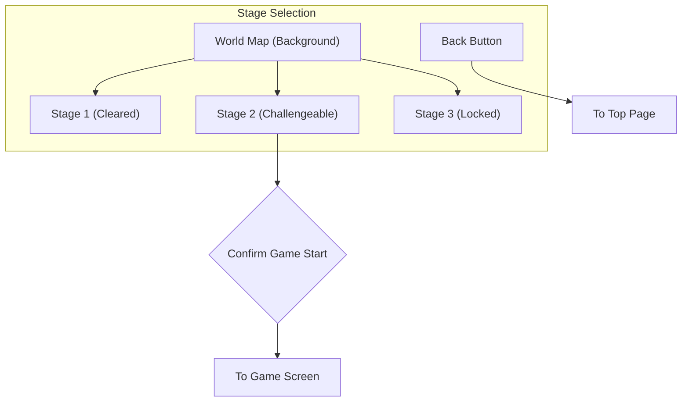
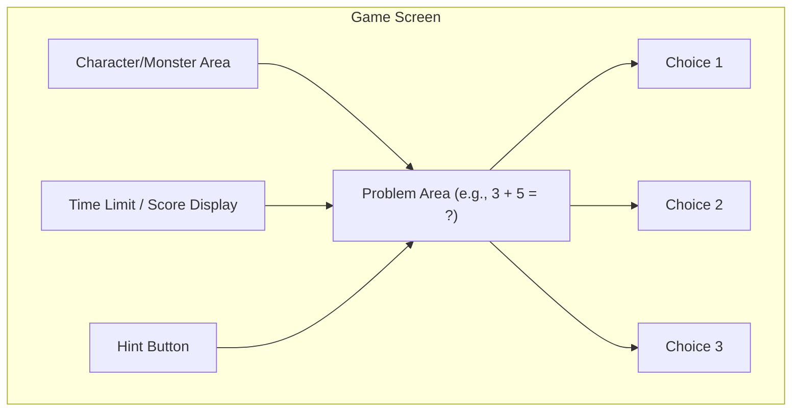
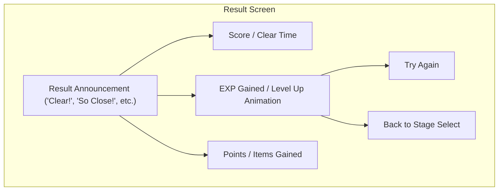
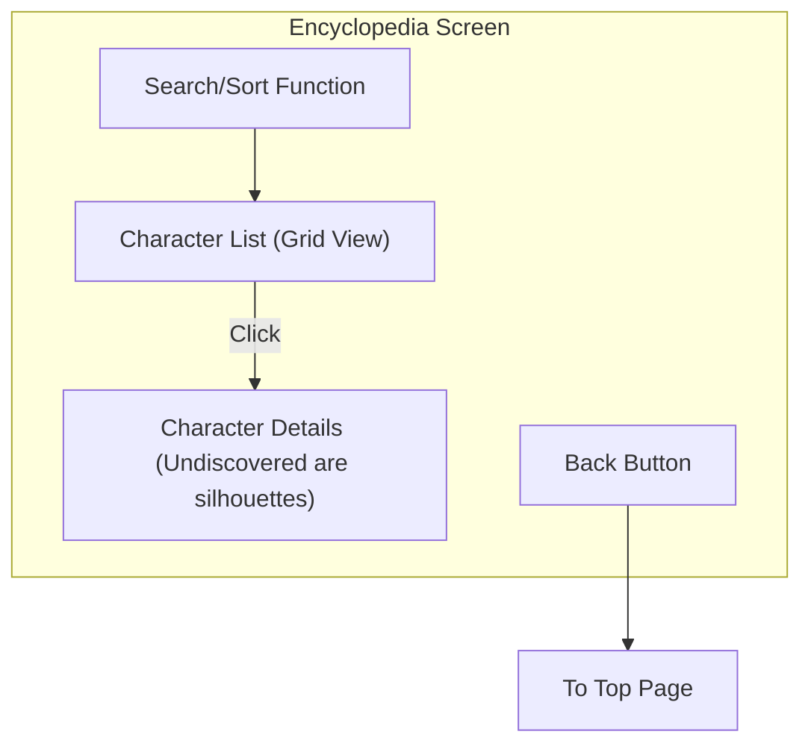

# mathquest: Wireframes

Below are the wireframes for the main screens of mathquest. This is the structural backbone of the UI; the final design will incorporate richer colors, illustrations, and animations.

## 1. Top Page (Home Screen)

This is the first screen users see after logging in. From here, they can navigate to various content.

| Element             | Description                                                                                 |
| :------------------ | :------------------------------------------------------------------------------------------ |
| **Player Info**     | Displays the player's avatar, current level, and name. Their growth is visible at a glance. |
| **Start Adventure** | Navigates to the main game's stage selection screen.                                        |
| **Encyclopedia**    | Allows viewing a list of monsters and characters encountered so far.                        |
| **Shop**            | Players can use points collected in the game to purchase avatar outfits and items.          |
| **Announcements**   | Displays information about new events and updates from the administrators.                  |

## 2. Stage Selection Screen

This is the world map where the adventure unfolds. Cleared stages and the next stage to be challenged are visually displayed.

| Element                | Description                                                                                                    |
| :--------------------- | :------------------------------------------------------------------------------------------------------------- |
| **World Map**          | A map where multiple stages are placed, divided by themes like forests, volcanoes, and seas.                   |
| **Stage Icon**         | Icons representing each stage. Their appearance changes based on completion status (e.g., a flag for cleared). |
| **Confirm Game Start** | Tapping a stage displays the level and content of the challenge, prompting for final confirmation.             |

## 3. Game Screen

This is the screen where users actually solve math problems. The layout is simple and clear to avoid distracting focus.

| Element                | Description                                                                                                                  |
| :--------------------- | :--------------------------------------------------------------------------------------------------------------------------- |
| **Problem Area**       | Displays calculation formulas or word problems. It will be made visually easy to understand with illustrations and diagrams. |
| **Character Area**     | Shows the monster posing the question or a character cheering the player on. It animates based on correct/incorrect answers. |
| **Choices**            | 3-4 answer candidates are displayed. Users answer by tapping one.                                                            |
| **Time Limit / Score** | An element to increase player concentration. May not be displayed for some stages.                                           |
| **Hint Button**        | A feature to get a hint when completely stuck. A penalty, such as a slight score reduction, is being considered.             |

## 4. Result Screen

The result screen is displayed after the game ends. It fosters a sense of accomplishment and motivation for the next challenge.

| Element                 | Description                                                                                                                                      |
| :---------------------- | :----------------------------------------------------------------------------------------------------------------------------------------------- |
| **Result Announcement** | Praises the player's effort with a message and illustration corresponding to their accuracy and score.                                           |
| **Score / EXP**         | Shows the results of the play session in concrete numbers. The level-up animation is made especially flashy to enhance the sense of achievement. |
| **Items Gained**        | If a new character or item is acquired, it is announced here.                                                                                    |
| **Next Action**         | Allows the user to smoothly transition to the next action by choosing to "Try Again" or "Back to Stage Select".                                  |

## 5. Encyclopedia Screen

As a collection element, this screen allows users to view the characters they have met in the game.

| Element               | Description                                                                                         |
| :-------------------- | :-------------------------------------------------------------------------------------------------- |
| **Character List**    | A thumbnail list of all the monsters and characters encountered so far.                             |
| **Character Details** | Selecting a character from the list displays a large illustration and a description (e.g., trivia). |
| **Search/Sort**       | Allows characters to be sorted or searched by grade, type, etc.                                     |

Based on these wireframes, we will proceed with more detailed screen design and visual development.
